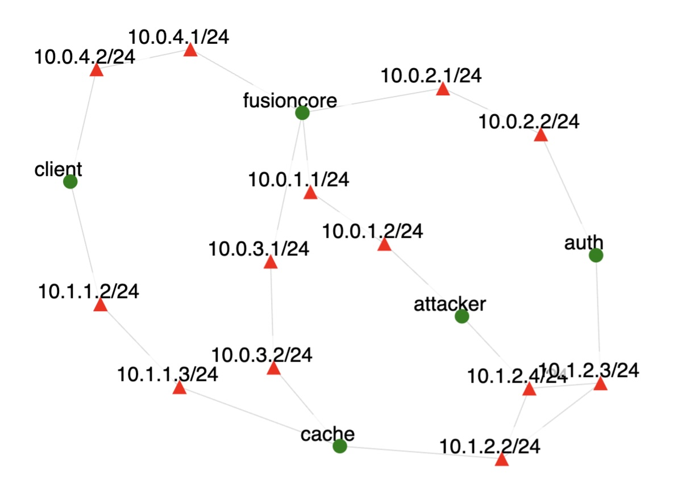

# DNS Mitm (Real Use)

Traffic was generated on the topology shown below.

Green circles denote nodes and red triangles denote interfaces on a node.
In the scenario:
- We installs dnsutils and traceroute on the **client** node via apt
- We create /etc/ettercap/etter.dns with the spoofed IP address on **attacker**
- On **attacker** we use ettercap to arp poison and dns spoof the LAN for the rest of the experiment. Poisoning occurs between **cache** and **auth** nodes so that **cache** believes that **attacker** node has the IP of the **auth** node
- We set up named config files to implement dnssec on **cache**
- We set up named config files to implement non-dnssec case on **cache**
- We activate non-dnssec case, and make **client** run `dig google.com` 3 times
- We activate dnssec case, and make **client** run `dig google.com` 3 times
- We kill ettercap on **attacker** node

