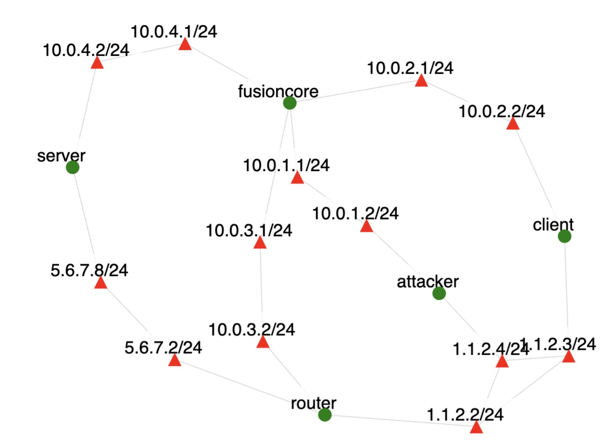

# TCP SYN flood (Real Use)

Traffic was generated on the topology shown below.

Green circles denote nodes and red triangles denote interfaces on a node.
In the scenario:

- We run tcpdump on **client** node
- **Client** runs `curl server/index.html` every second
- **Attacker** generates the SYN flood attack on port 80 at the **server** using `flooder` program then stops it after a while
- We stop the `curl` and `tcpdump` programs on the **client**
- Syn cookies are activated on **server**
- We run tcpdump on **client** node
- **Client** runs `curl server/index.html` every second
- **Attacker** generates the SYN flood attack on port 80 at the **server** using `flooder` program then stops it after a while
- We stop the `curl` and `tcpdump` programs on the **client**
