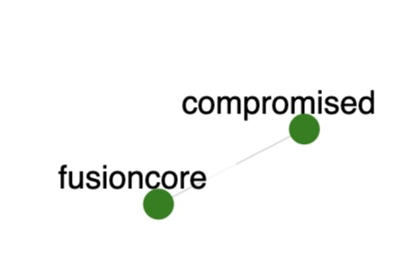

# Cryptomining Scenario (Malware)

Traffic was generated on the topology shown below.

Green circles denote nodes. 
In the scenario:
- We download [xmrig](https://github.com/xmrig/xmrig) from Github on the **compromised** node
- We unzip the file and start mining Monero
