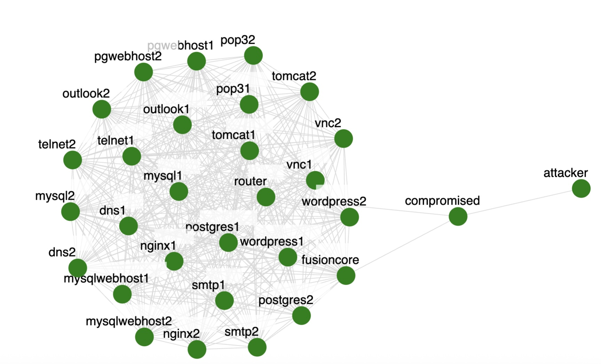

# Portscanner Scenario (Malware)

Traffic was generated on the topology shown below.

Green circles denote nodes. All nodes except **compromised** and **attacker** are on the same LAN.
In the scenario (Spencer fill here following the model below):
- We run byob on the **attacker** node to act as botnet master
- The master starts the byob client on the **compromised** node
- The master runs the port scanner malware on **compromised** node and scans 10.10.10.0/24 subnet
- The master kills byob software on **compromised** node
- We stop byob server on **attacker** node

