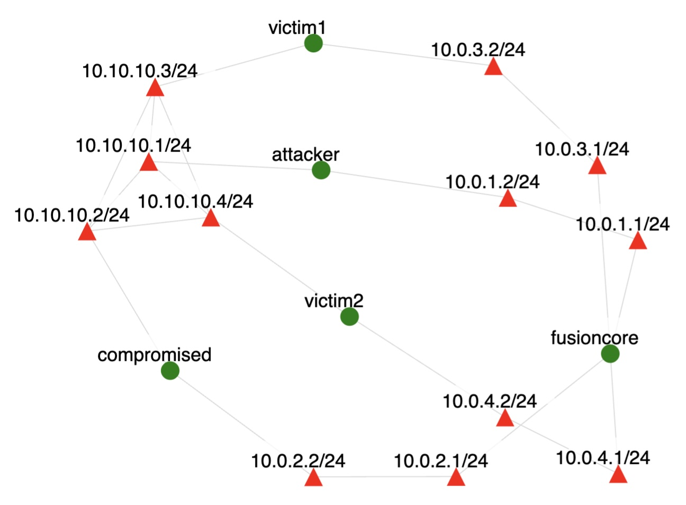

# BYOB Spread Scenario (Malware)

Traffic was generated on the topology shown below.

Green circles denote nodes and red triangles denote interfaces on a node.
In the scenario:
- We run byob on the **attacker** node to act as botnet master
- The master starts the byob client on the **compromised** node
- The master runs the email spreader attack on **compromised** node. 'lwtchatone@gmail.com' is compromised email address and one
message is being sent to the 'lwtchattwo@gmail.com' target. While in a real scenario many more messages would be sent to
different targets, we did not want to generate unnecessary spam. This one message is sufficient to create a record of how an
email message leaves the research infrastructure, which is non-typical behavior for our users' experiments.
- The master kills byob software on **compromised** node
- We stop byob server on **attacker** node
